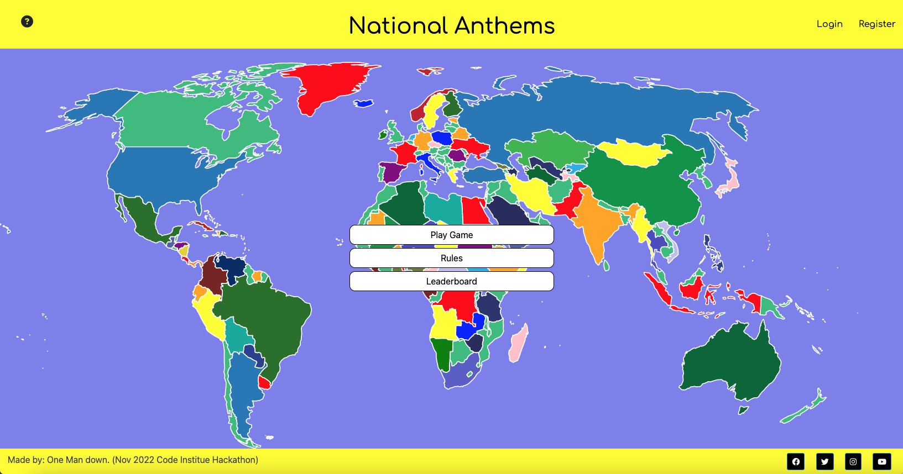
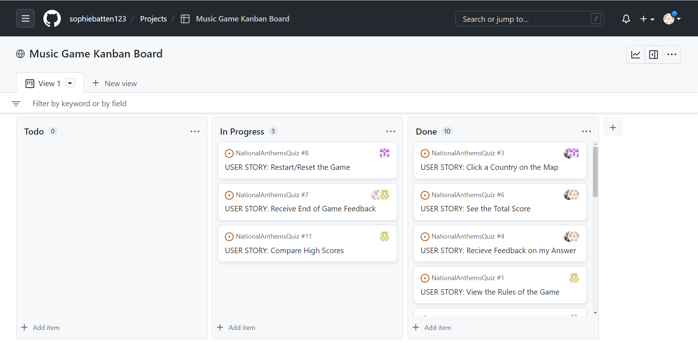

[Game Live Link](https://anthem-game.herokuapp.com/)
[GitHub Repository](https://github.com/users/sophiebatten123/projects/2/views/1)

## NATIONAL ANTHEMS

(Developers: Sophie Batten, Laura Mayock, Sarah Todd, Muzhda Noorzad)

National Anthems is an educational and interative game that tests a players knowledge of some of the worlds most famous National Anthems.

## How to play

To play Nationak Anthems click the 'Play Button' on the main page, be ready as after you have clicked the button you will hear the first National Anthem! 

After you have listened to the National Anthem you should select on the map which country you think it originates from, to select the answer click the country using your mouse. How did you do?

Click next to play the next National Anthem. Good Luck!

# Table of Contents:

- [Idea Brainstorming](#idea-brainstorming)
- [User Stories](#user-stories)
- [Wireframe](#wireframe)
- [Testing](#testing)
- [Credits](#credits)

## Idea Brainstorming

## User Stories

### EPIC: Game Functionality

| ID | As A |I want to be able to...|So that I can...|MoSCoW|
|----|------|-----------------------|----------------|------|
|1| Site User | View the rules of the game when clicked | See how to play the game at any stage | Mo |
|2| Site User | Click a play button which is over the top of the map | Hear the first national anthem and start the game | Mo |
|3| Site User | Click a country on the map | Answer the question as to where the national anthem comes from | Mo |
|4| Site User | Receive feedback on my answer | Know whether I got it right or wrong | Mo |
|5| Site User | Click a Next Button | Play the next round and hear the next national anthem | Mo |
|6| Site User | See a Tally of my Score | Keep track of how many questions I have got correct | Mo |
|7| Site User | Receive feedback on my game when finished | See how I did in the game overall | Mo |
|8| Site User | Restart the Game | Attempt the questions again | Mo |

### EPIC: Login and High Score Data Storage

| ID | As A |I want to be able to...|So that I can...|MoSCoW|
|----|------|-----------------------|----------------|------|
|9| Site User | Login to my account | Keep track of my high scores | S |
|10| Site User | Signup to an account | Keep track of my high scores | S |
|11| Site User | Be able to compare my high score against other users | Compete against others | Co |
|12| Site User | Logout of my account | Allow others to log in on my device | S |

### EPIC: Social Media

| ID | As A |I want to be able to...|So that I can...|MoSCoW|
|----|------|-----------------------|----------------|------|
|13| Site User | Navigate to the games social media page | Receive the latest updates to the game | S |

## Wireframe

## Kanban

## Testing

- We have tested the site in line with the user stories
 - Game Functionality
 - Log in and Leaderboard
  - Log in working correctly and storing user score on leaderboard when viewed.
 - Social Media Links
  - All social media links working correctly and opening in a new screen

- We tested the game accross Chrome, Firefox and Safari

- Responsiveness
 - This game was designed to be played on a laptop or desktop device and uses the mouse click function to play.

## Credits